+++
date = '2026-06-12T23:23:35+08:00'
draft = false
title = '庐山游记'

+++

## 上庐山

6月初，我先前往珠海、惠州、广州，见女朋友。随后坐火车前往南昌。在南昌游玩一日后，晚上又前往九江，第二天去游玩庐山。

庐山久负盛名，我很早就想去了，到了之后果然名不虚传。虽然说景色不及华山之险峻与黄山之秀丽，但其人文景观却似乎天下无二。且不说九江的“浔阳江头夜送客”，光是山上山脚，就有陶渊明、李白、朱熹，乃至毛泽东、蒋介石等多人的遗迹。

从九江市区可以直接打车前往庐山景区。庐山景区有东、南、西、北四个门。其中东、西两门主要是走步梯，或坐缆车上山，而南、北两门可以坐车上山。上山之后，景观大多分布在庐山上一个叫牯岭镇的小镇附近，范围大约十几公里。其间星星点点地分布着许许多多的景点，景点之间可以乘坐观光巴士通行。我从庐山北门坐观光车上山，直达牯岭镇。据说，在汽车普及前，达官贵人主要依靠轿子上山。蒋介石初上庐山时，也是靠人抬轿子。抬到庐山上一个非常险峻的地方时，轿夫沉着稳当，蒋介石连叫三声“好汉”，这也成了“好汉坡”的由来。而毛泽东在庐山会议时，则是从武汉乘船沿长江直达九江，然后从北门坐汽车上山。

我也从北门上山，直达牯岭镇。山上比我想象中冷许多，虽然是6月份，但我穿一件短袖仍然觉得单薄。与广州的炎热相比，这里非常清冷，天高云淡。

庐山上的牯岭镇开发自20世纪初。长江通航以后，九江成为一个可通航的港口，许多外国人也由此进入九江。有一个颇有商业嗅觉的英国人，在山上建立了牯岭镇。而著名的赛金花虽然长居江苏，但也经常来牯岭镇避暑。因此牯岭镇上建有许许多多的西式别墅。牯岭镇的常规别墅，淡季每月也只要四五千，一室一厅，价格堪堪可比北京海淀区的破单间。

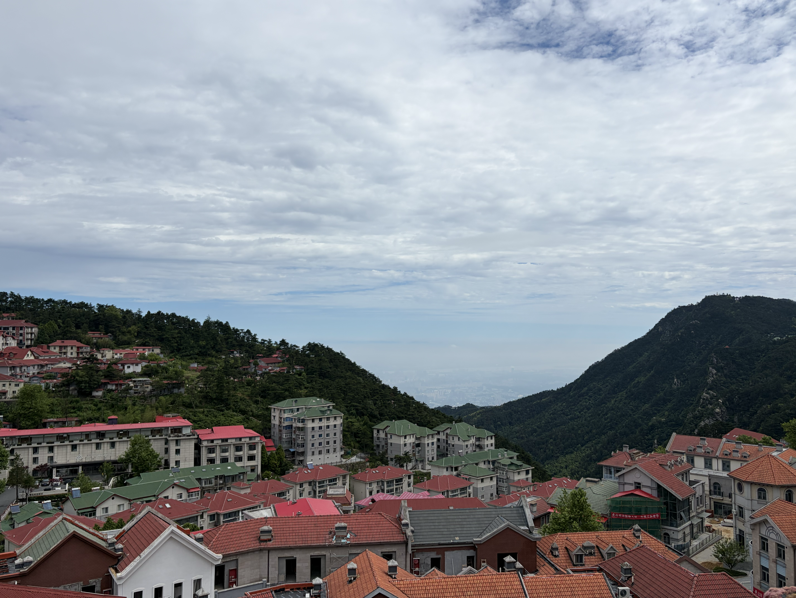

## 庐山历史建筑

从牯岭镇向南走，就可以看到许许多多的历史建筑，如邓小平、刘少奇、蒋介石等人住过的别墅。其中最著名的要数美庐别墅。正如南京之美龄宫，美庐别墅也是以宋美龄命名的。而从美庐别墅继续向前走，就可以看到蒋介石等人经常礼拜的庐山基督教堂。文革前后，教堂被改为电影院。现在虽然恢复了教堂外貌，但内部依然用作电影院，循环播放《庐山恋》。正如文革后恢复了教堂外貌，《庐山恋》电影也主要讲述国民党退役将军之女与共产党子弟，在改革开放后于庐山重逢，解开恩怨心结，定下终身。

中华民国成立之后，因为南京夏季炎热，需要一个地方避暑办公，而庐山的夏天常年在20度左右，非常凉快。因此庐山成为了事实上的中华民国夏都，也是夏天的政治中心。因此这里也发生过许许多多的历史事件。建国后迁都北京，领导人习惯于在北戴河避暑。但是在前30年的毛泽东时代，各种重要会议也往往随着毛泽东的心情在全国各地召开，其中庐山上也有三次著名的会议，均具有转折性的意义。

既然是政治中心，普通人自然很难上山了。在民国时候，百姓穷苦，几乎无人主动上山，只有有钱人才会上山。1935年，民国政府收回牯岭镇主权后，将其划为夏都。夏季自然高官云集，安保加强，流民几乎无法进入别墅区域。新中国成立后，上山更为严格。庐山是中央重要的会议和干部疗养基地，进入都需要审核批准。原有的国民党高官、资本家的别墅全部收归国有。只有1978年改革开放后，庐山才逐渐对普通人开放。我们现在只要买门票就可以上庐山了。如果说社会主义的核心价值观是平等，那么到底是改革开放前，还是改革开放后更平等呢？

当然，这种夏都，或者说全国各地开会议的形式，在政权逐步正规化，以及空调、无线网络会议等技术发明之后，便逐渐取消了。现在已经很少听到在北京以外举行重要会议了。这也是庐山开放为普通旅游景区的一个原因。或许不平等永远存在，只是在现代的科技下变得更为隐秘了。

在庐山景区，大概可以分为三条线，西线、中线和东线。其中西线和东线多为自然景观，而中线主要是人文景观，包括各种名人住过的别墅和博物馆。在近代，庐山最著名的事件就是庐山谈话、庐山抗战以及庐山会议了。

在庐山成为中华民国夏都时，庐山建造了三座著名建筑，构成核心的政务建筑群，分别是庐山图书馆、庐山大礼堂以及庐山大厦。1937年7月17日，蒋介石在庐山图书馆发表庐山谈话，“地不分南北，人不分老幼，皆有守土抗战之责任”，就是在这里演讲的。目前的庐山图书馆被用作抗战纪念馆。

上面这种著名的庐山抗战谈话，假如国民党胜利的话，恐怕会被当作如同丘吉尔演讲一般的存在。当然，这个谈话并不是出自蒋介石，而是出自陈布雷，一个如同传统谋士、文人一般的角色。他在1948年国民党败局已定之时，因为绝望而自杀。

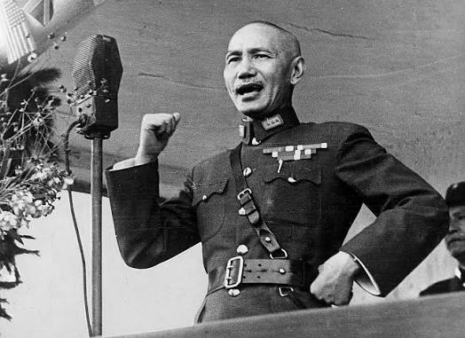

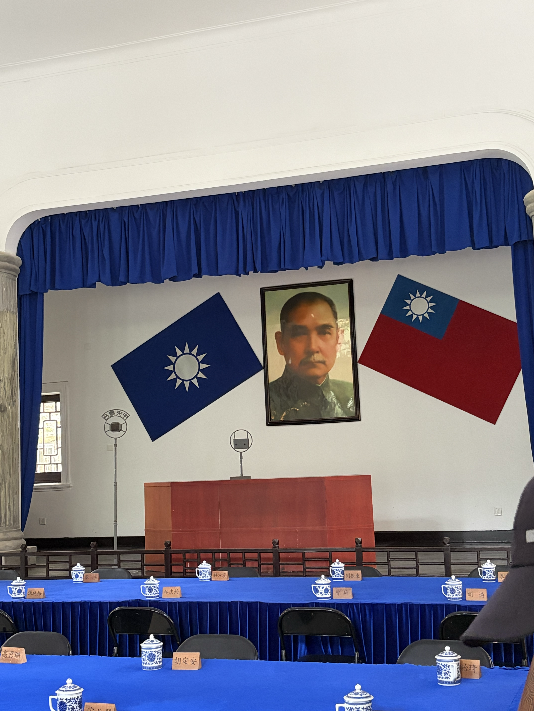

庐山大厦则改为酒店。

庐山大礼堂因为发生过三次庐山会议，因此改为庐山会议纪念馆。

所谓“庐山会议”，事实上并不只是一场，而是三场，分别发生在1959年、1961年和1970年。并且，“庐山会议”本身也只是一个俗称或简称，它们各自的正式名称并不相同。要理解这几次庐山会议究竟意味着什么，首先需要对中国共产党的基本组织方式和运行逻辑有一套大致了解。

中国共产党最重要的会议是党的全国代表大会。党代会的代表，理论上由各级党组织逐级选举产生。也就是说，基层党组织选出上一级党代会代表，再由上一级党代会继续选出更高一级的代表，最终产生全国代表大会代表。当然，这种选举并不是西方式的竞争性差额选举，而是在上级党委的领导、监督和组织推荐之下进行的党内选举。党的全国代表大会负责确定党的基本路线，修改党章，并选举中央委员会。

中央委员会是党的全国代表大会闭会期间的最高领导机关，人数通常有几百人。中央委员会召开的会议，被称为中央委员会全体会议，也就是通常所说的“中央全会”。比如“八届八中全会”，全称就是中国共产党第八届中央委员会第八次全体会议。其中，“八届”指的是中国共产党第八次全国代表大会选出的中央委员会，“八中全会”则是这个中央委员会召开的第八次全体会议。

在中央委员会之上，又会产生几十人的中央政治局，以及权力更集中的中央政治局常务委员会和中央委员会总书记。在中央全会闭会期间，党的日常领导工作主要由中央政治局及其常委会负责。因此，最核心的决策通常由总书记和几位常委作出。如果需要在更大范围内统一认识，就会召开中央政治局会议，甚至召开中央全会；如果涉及党的路线、党章修改或换届等重大问题，则需要召开全国代表大会。

当然，这是一个总体上的制度逻辑。改革开放前，党的会议召开方式相对更灵活，制度化程度没有后来那么高。改革开放以后，党内会议逐渐章程化、体制化和常规化。例如，全国代表大会基本固定为每五年召开一次，中央全会也逐渐形成较为固定的节奏，不同次序的全会通常也会承担相对固定的议题。

同时，在法理和实际运行上，党也深深嵌入国家政权之中。政府官员表面上是通过国家机关内部程序产生的，比如各级人大选举产生相应的国家机关负责人。但这些选举程序本身，往往需要各级人大主席团提出候选人，而主席团又通常处在党的领导之下。主席团成员与党委系统、组织系统之间高度重合，候选人的产生也经过党委考察、组织部门考察和党内酝酿。因此，党实际上通过组织路线和干部路线，将自己的决定转化为国家机关的正式程序。这样，党就成功嵌入了政府运行之中。

在人们的政治观念中，党也被视为一切权力的根本来源。这一方面来自长期“党管一切”的政治教育，另一方面也来自宪法和国家制度安排中对党的领导地位的确认。于是，在法理、组织和观念三个层面，党都居于国家政治生活的核心位置。

既然党能够控制政府，为什么还要区分党和政府呢？为什么不能像中国古代王朝那样，只有各级官僚机构，而不再保留一个独立的党组织？我的理解是，党和政府的区分本身具有功能意义。党可以通过党章、党纪和党内组织原则来管理党员，它的内部组织不需要像政府那样直接对全体社会成员负责，因此可以保持更强的组织纪律性、动员能力和内部灵活性。这也正是“先锋队”逻辑的来源。如果没有党，所有官僚都只能作为国家机关成员直接面对社会，内部运作的灵活空间就会小得多。

当然，改革开放后，党和政府之间也曾一度强调“党政分开”，试图在法理和职能上对党与政府的关系作出一定区分。但是，这种区分并没有背离党的领导原则，更没有否定党对国家政权的根本领导。

回到庐山会议。所谓三次庐山会议，分别对应1959年、1961年和1970年三次在庐山召开的重要会议。

1959年7月2日至8月1日，中共中央在庐山召开政治局扩大会议，主要讨论“大跃进”以来出现的“左”的问题。这次会议最初的范围并不特别大，主要是中共中央政治局扩大会议，参加人数大约几十人，会议地点在庐山招待所的一间西餐厅中。然而，7月14日，彭德怀写信给毛泽东，对“大跃进”和人民公社化中的问题提出批评意见。这封信就是“彭德怀万言书”。毛泽东对此极为不满，会议方向也随之急转。

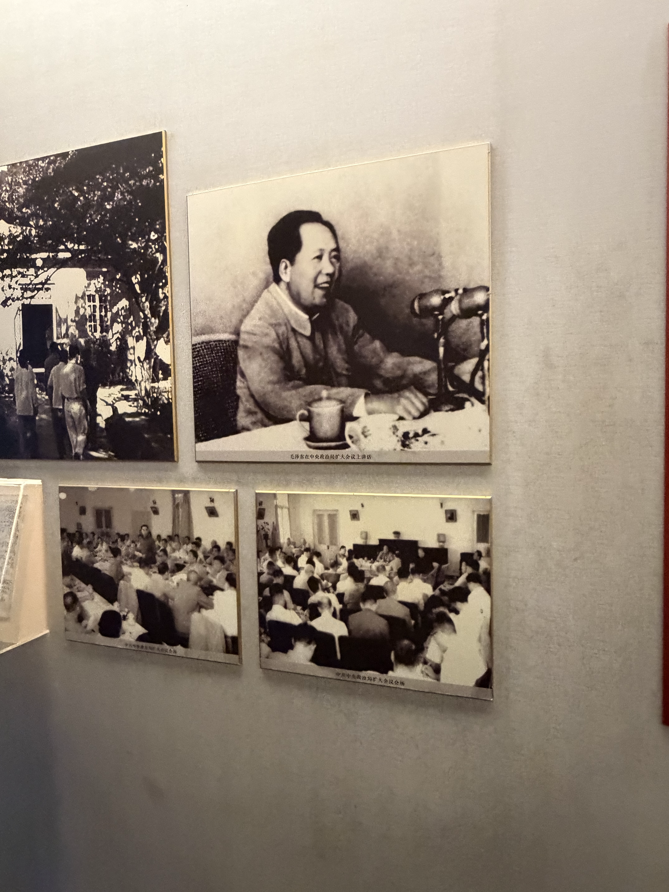

于是，1959年8月2日至16日，中共中央又在庐山紧急召开八届八中全会，也就是中国共产党第八届中央委员会第八次全体会议。相比此前的政治局扩大会议，中央全会的规格更高，参加者也更多，中央委员和候补中央委员都被召集到庐山。会议最终由纠“左”转向反右，彭德怀、黄克诚、张闻天、周小舟被打成“反党集团”。因此，1959年庐山会议在中共党史上最重要的意义，就是它标志着党内对“大跃进”问题的纠偏努力被中断，政治斗争重新压倒了政策调整。

1961年的庐山会议，则是1961年8月至9月召开的庐山中央工作会议。它并不是一次正式的中央全会，而是中共中央召开的一次工作会议。由于“大跃进”和人民公社化运动造成了严重困难，这次会议的主要背景，是中央开始面对经济困难，并推动政策调整。与1959年庐山会议相比，1961年庐山会议的政治冲突色彩没有那么强，它更主要体现为困难时期的一次政策调整会议。

我们今天提到“庐山会议”，首先想到的通常是1959年的庐山会议，其次就是1970年的庐山会议。1970年的庐山会议，正式名称是中国共产党第九届中央委员会第二次全体会议，也就是九届二中全会。它于1970年8月23日至9月6日在庐山召开。

这次会议发生在文化大革命的高潮之后。1969年，中共九大已经把林彪作为毛泽东的接班人写入党章。但到了1970年，毛泽东与林彪集团之间的矛盾已经逐渐显露，并在庐山会议上集中爆发。九届二中全会期间，围绕国家主席设立、天才论、权力格局等问题，会议内部出现了激烈冲突。最终，这次会议直接导致陈伯达失势，也使毛泽东与林彪集团之间的矛盾公开化。

此后，毛泽东发动“批陈整风”，逐步削弱林彪集团的政治基础。1971年“九一三事件”发生后，林彪出走并坠机身亡。由此来看，1970年庐山会议是文革内部权力结构发生重大转折的关键节点。

## 东线景观

看完庐山谈话以及抗战旧址，已然中午12点多。一日特种兵旅行显然不足以逛完整个庐山，所以我就主要选择了东线的一些景点，准备从东门下山。东线主要有芦林湖、含鄱口、五老峰以及三叠泉。

芦林湖。毛泽东曾于此游泳。

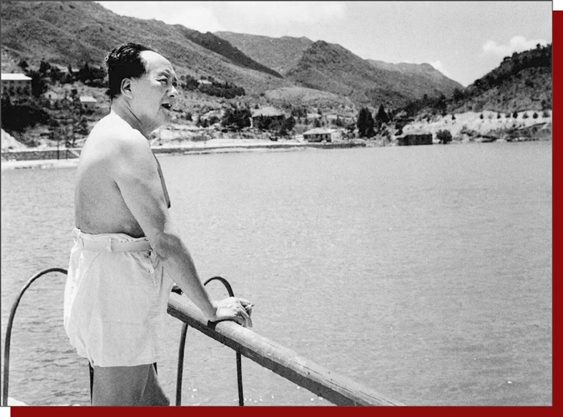

含鄱口望鄱阳湖。

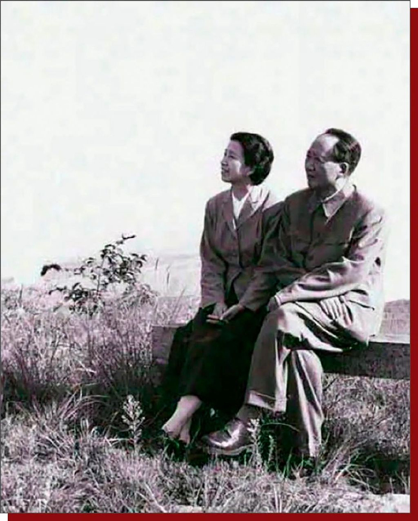

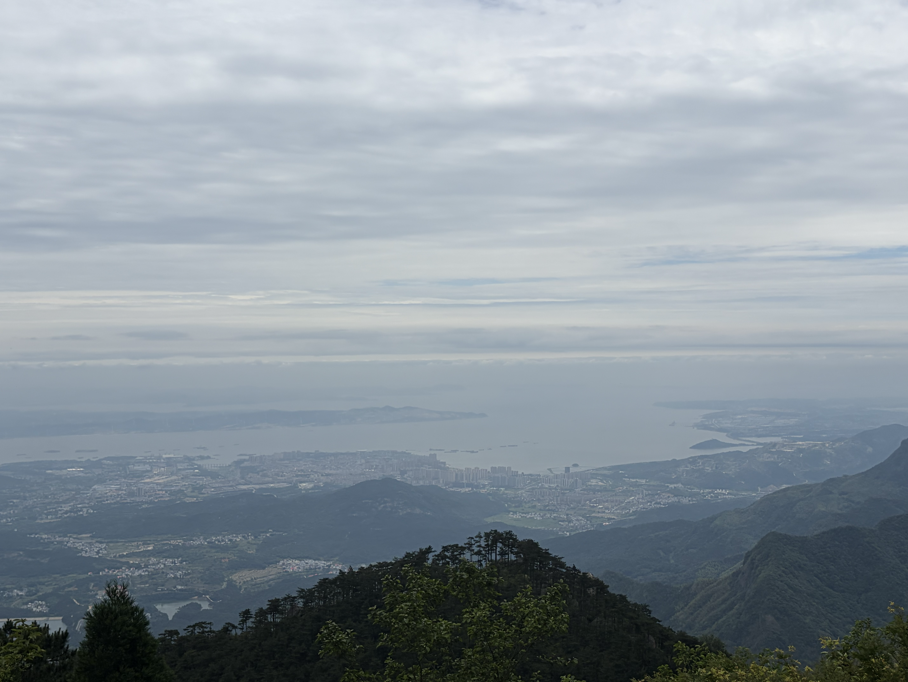

五老峰在山中看，不识其面貌。

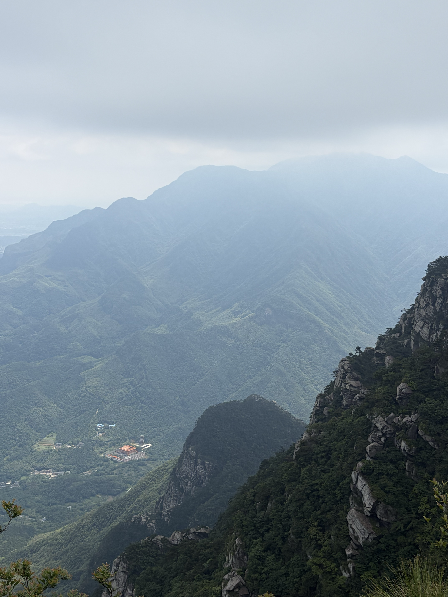

在山下才见到五老峰的真面目。果然是“不识庐山真面目，只缘身在此山中”。

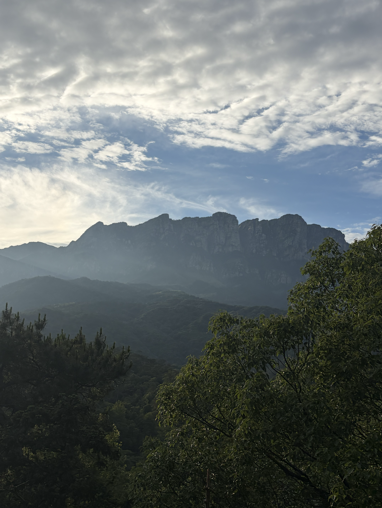

最后我经三叠泉从东门下山。三叠泉应是庐山最著名的景色了，“不到三叠泉，枉为庐山客”。

## 白鹿洞书院

从庐山东门下山之后，打车几分钟内就可以到白鹿洞书院。白鹿洞书院的许多景致，我觉得甚至好于庐山山上。那里人员较少，非常幽静，不禁让人感受到几百年前书院的氛围。

传统建筑大体可以分为寺庙、道观、宫殿、园林以及书院几类。寺庙、道观世俗气太重，宫殿太过华贵，园林往往游客太多，似乎只有书院是一个清静的好去处。

白鹿洞书院延绵千年有余，兴盛于宋代朱熹整顿之后，成为儒学探讨义理之地。然而清朝以后，书院逐渐沦为官学，丧失了生命力，学生们都忙于科举考试。直到民国以后，书院废去，改为大学。当然，大学目前校址已经不在这里了。而白鹿洞书院在后来又变为一个景点。

门口的“白鹿洞书院”为李梦阳所题。在庐山脚下见到一个同为庆阳人的题字，而且还是明朝人，也颇感自豪。

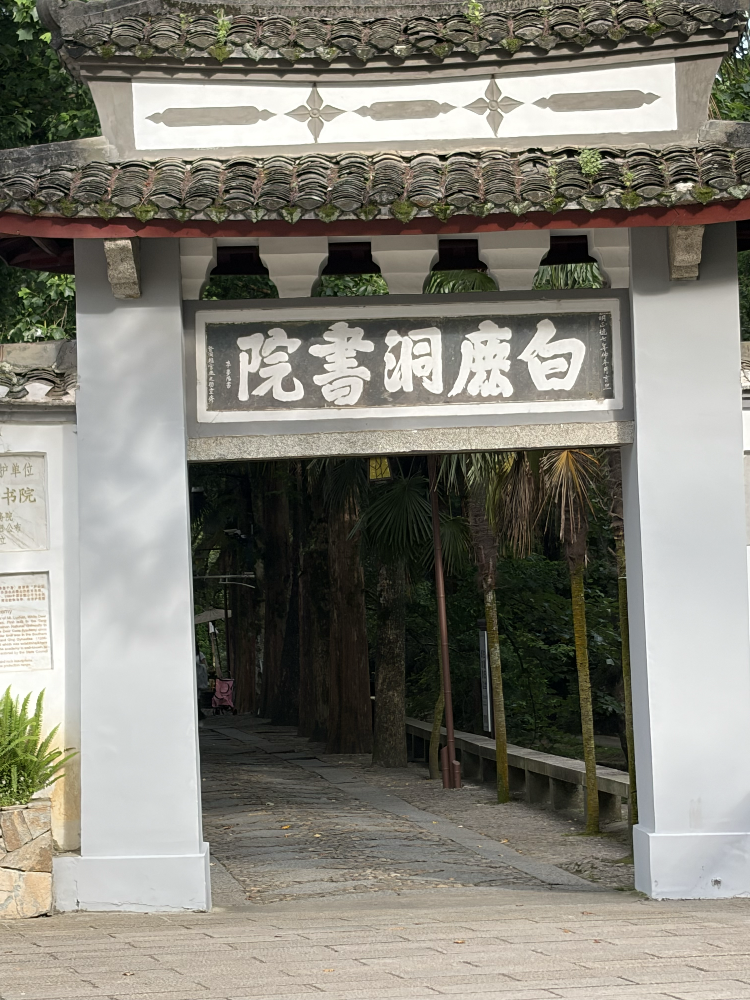

白鹿洞书院依山傍水，在山脚下有许多摩崖石刻，历代洞主与名人所题之字不少。

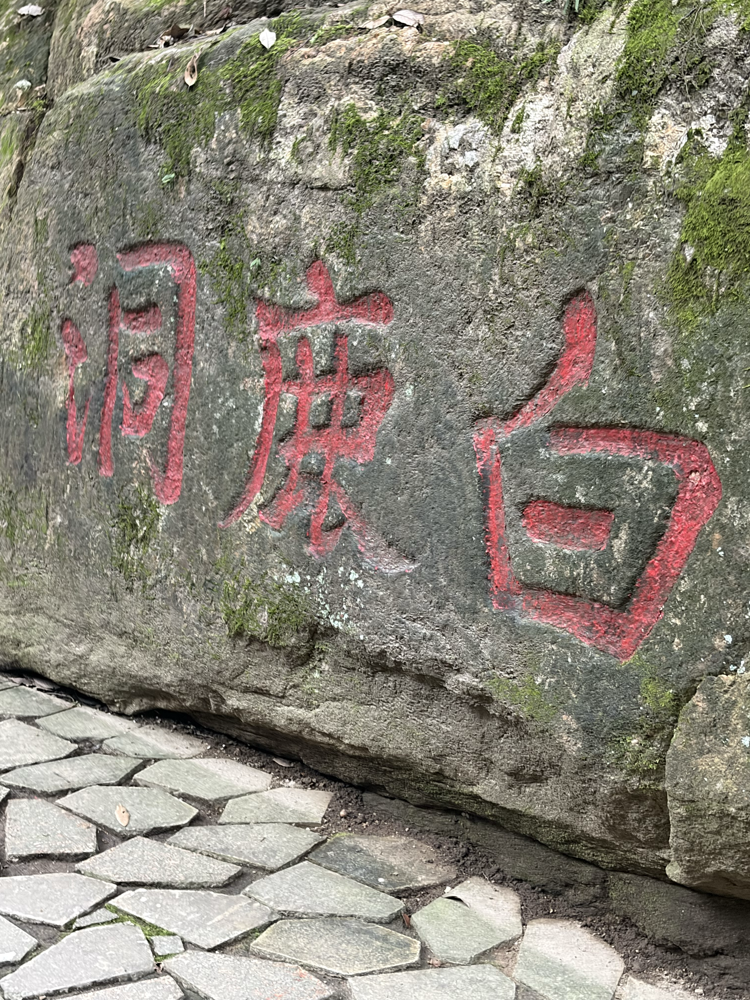

书院后山比较大，且寂寥，几乎没有行人，非常幽静，甚至有些恐怖。我5点多进入后山，行走半天找不到尽头，最后决定在日落前返回，因此只到了一个山头。在山头上有一个凉亭，在这里眺望庐山也是非常舒畅。

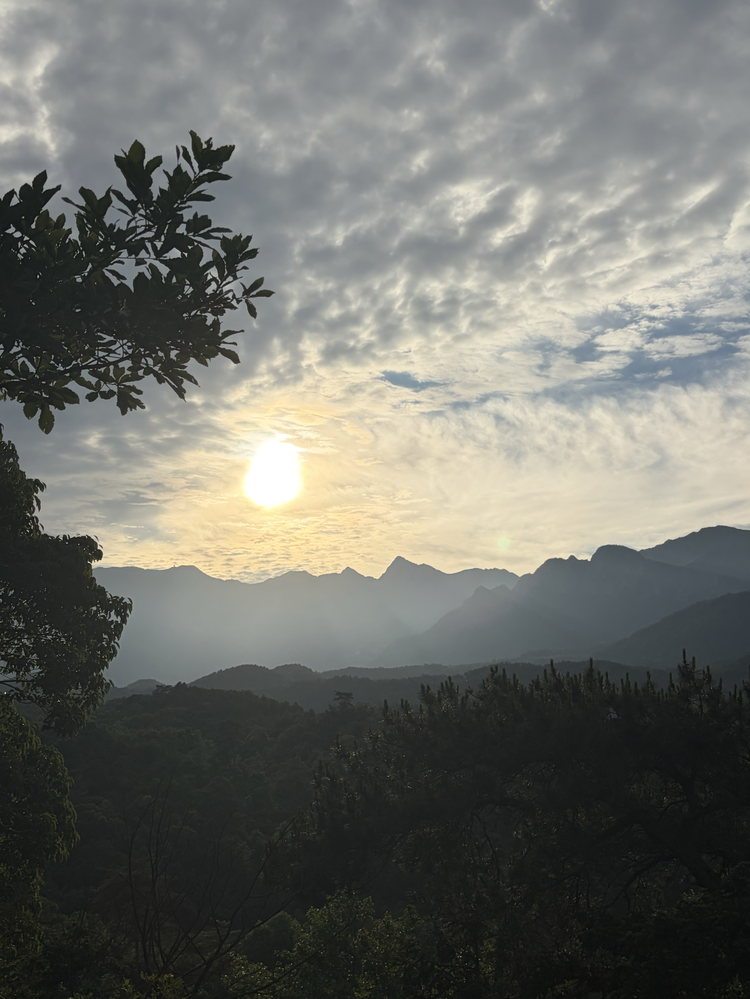

出书院后，路遇一只野狗狂吠着向我扑来，幸好我手中有登山杖，挥舞之后才得以驱赶。由此也得了一个教训，在野外人迹稀少之地，一定要手里有武器。

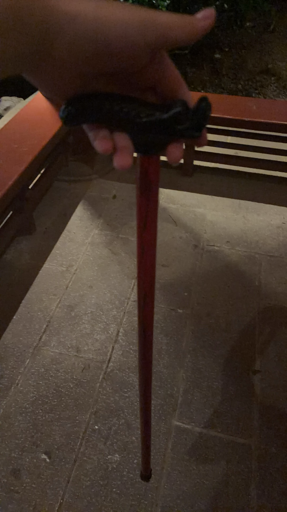

