+++
date = '2025-05-31T22:44:19+08:00'
draft =false
title = '扬州游记'

+++

清代大运河衰落前，扬州因运河之利而繁华富庶。"腰缠十万贯，骑鹤下扬州"诉说着当时的繁华盛景，"春风十里扬州路"中的"扬州瘦马"更是声名远播。然而到了清末，扬州日渐衰落，虽然狎妓之风逐渐消散，但浮夸享乐的风气依然存在，以致有"扬虚子"之称。衰落的扬州，恰似当时的清帝国。

而扬州文人，恰如当时的中国，虽然腐朽而自大，但也承袭了传统士大夫的风骨。诗词歌赋，琴棋书画，皆是发自真情，传递永恒的艺术感动。更为重要的是，他们仍保有自强不息的精神与爱国情操。扬州史可法衣冠冢的重要地位，正是明证。

每个时代都有其价值标准，这些标准往往产生于强健生命与时代巨轮的碰撞。我们不应简单地以现代价值观批判古人。但可以看到，即使在最传统的士大夫家庭中，自强不息的精神依然能激发革新的力量，如野火燎原，既能摒弃腐朽，又能开创新篇。

中华文化中蕴含着这种进取精神。1926年，江泽民生于扬州一个传统家庭。他融汇了传统、西方与马克思主义的教育精华，精通音律书法，通晓机电政务。在这些才能背后，我们依然能看到天行健的进取精神，以及修齐治平的社会理想。

造访扬州，水和船固然重要，但江同志故居更值得一游。

---

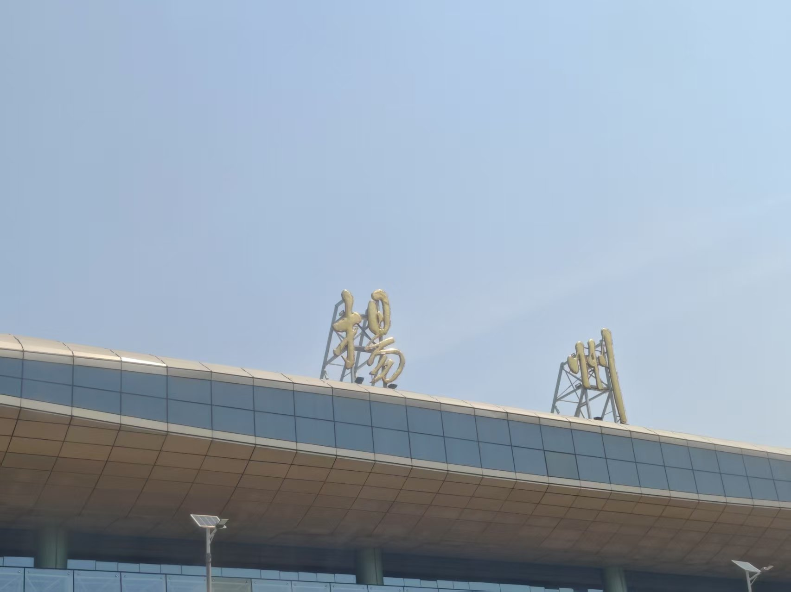
五月三十日清晨，搭乘高铁前往扬州。

抵达后换乘公交前往大运河博物馆。车上多是老年人，司机也操着地道的扬州方言。所幸扬州属于官话区，仔细聆听基本都能明白。

或许是受老龄化影响，城中年轻人较少。扬州市政府推出了面向南京大学生的"青扬码"政策，凭码可免费游览多数景点和乘坐公交。

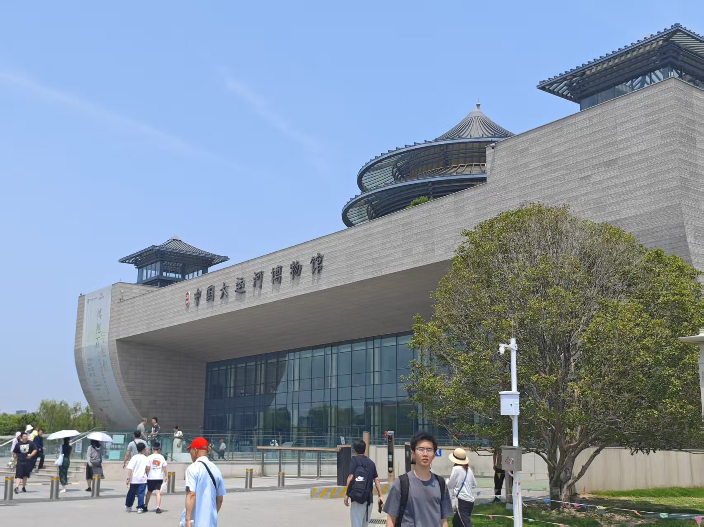
大运河博物馆内容丰富，共设三层十余个展厅，全方位展现了大运河与扬州的历史文化渊源。

令人叹为观止的是运河的工程智慧：由于地势起伏，运河各段流向各异，需要引入多处水源。古人巧妙运用水闸系统控制水流，解决了船只逆坡而上的难题。

在大运河博物馆门口发现了非常好喝的扬大酸奶。光这一天我就喝了四瓶。

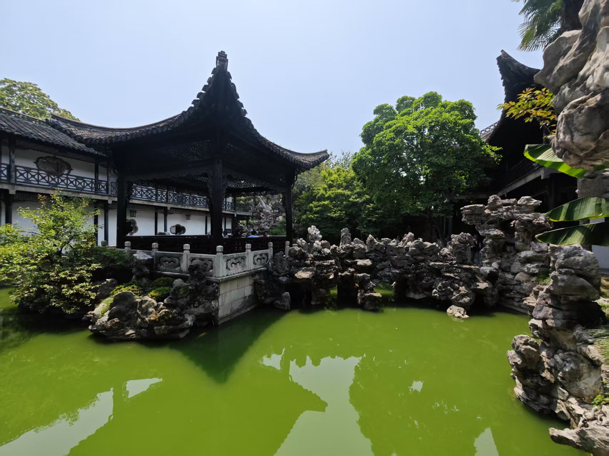

参观完运河博物馆之后，前往何园参观。但何园和苏州园林区别不大，而且在规模和精致度上更是不如苏州园林。

在何园的门口，品尝了五十一碗的扬州炒饭，虽然贵了点，但确实好吃。

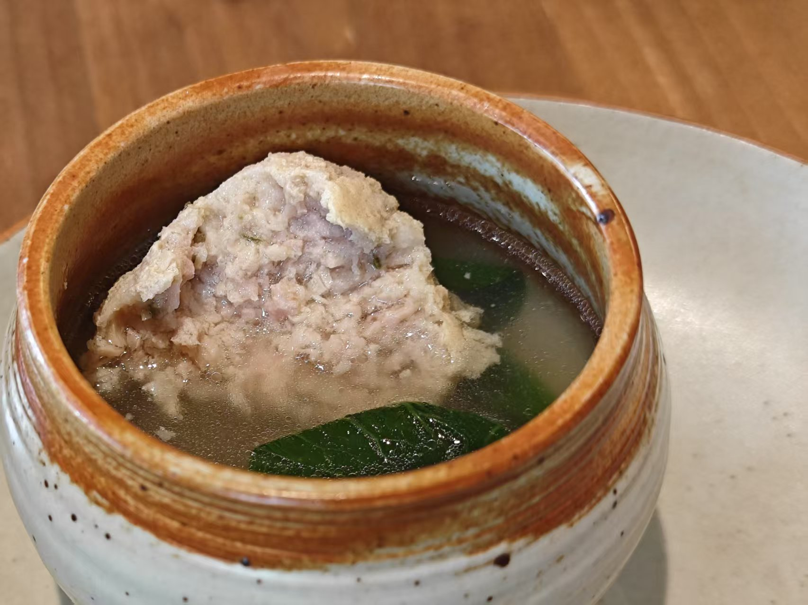

淮扬菜虽然清淡，但也美味。😋

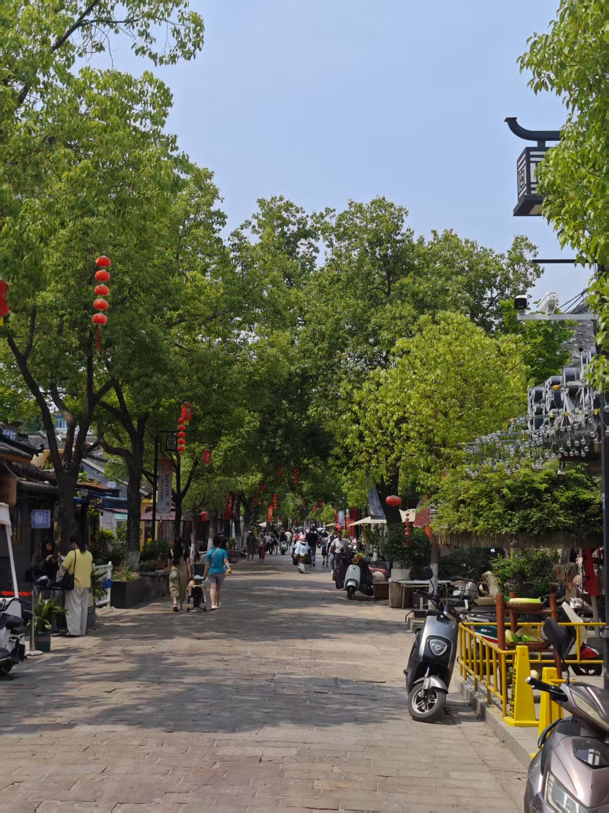

市中心皮市巷的小路。

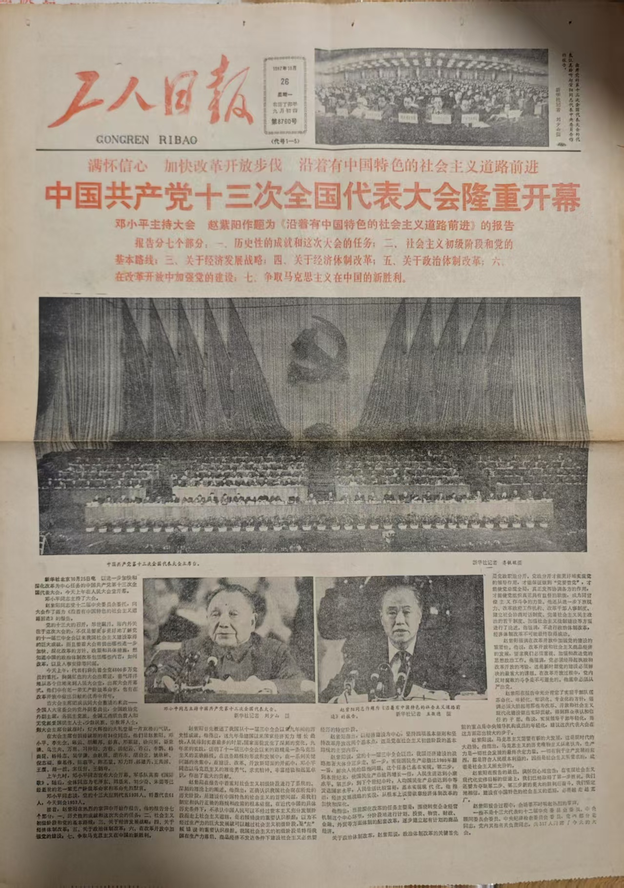

在江泽民故居附近发现了一家旧书店，里面不少老报纸和书籍，不禁看入了迷，最后花了三百大洋买了五份报纸两本书。出门之后忽然疑心自己被坑了... 这些老书回收价约为0，价格基本上取决于其历史意义，而历史意义什么的在每个人心中都不一样，就只能靠讲价摸清楚对方底线了... 

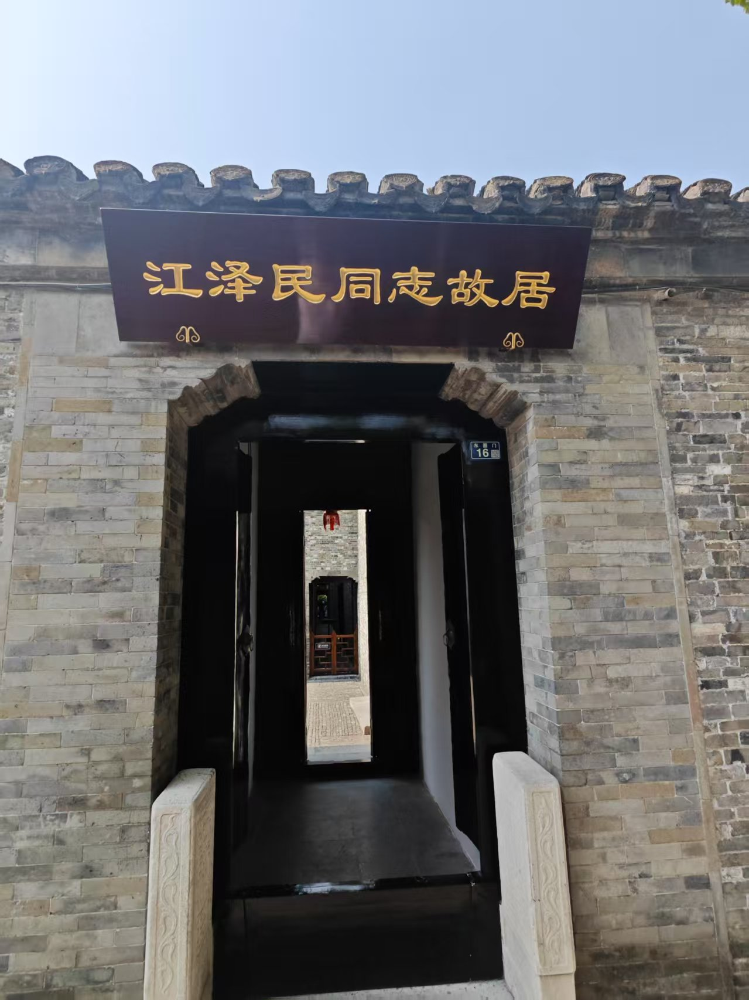

江同志故居，可惜里面不能拍照。

几进几出的大院在什么时候都算高档，不愧是扬州名门。也难怪江的多才多艺与热爱表达这么有有扬州文人的风格。要是没有养父江上青烈士，江同志的出身就是很大的问题了。

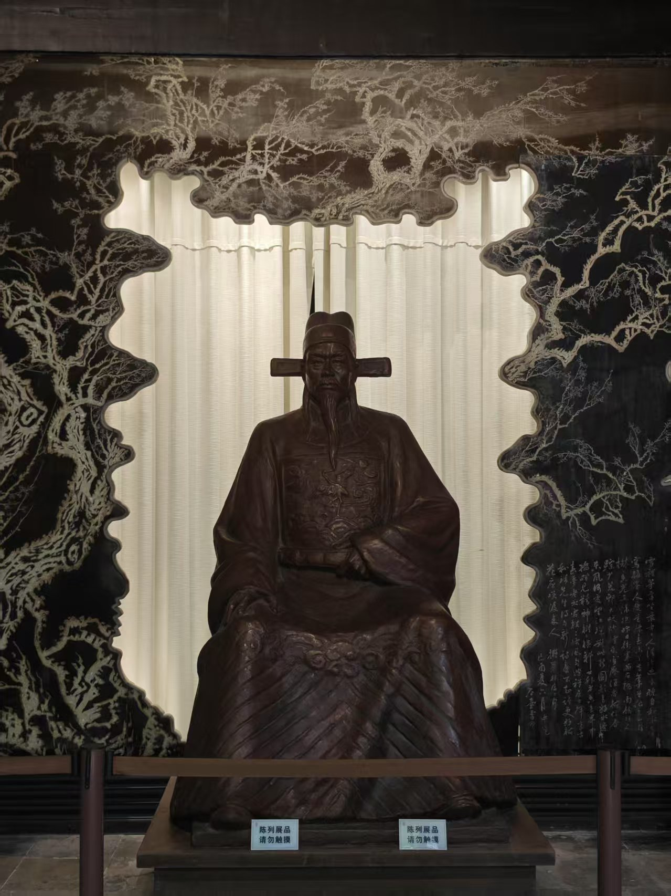

“数点梅花亡国泪，二分明月孤臣心”。爱国主义/民族主义总是那么有力量。

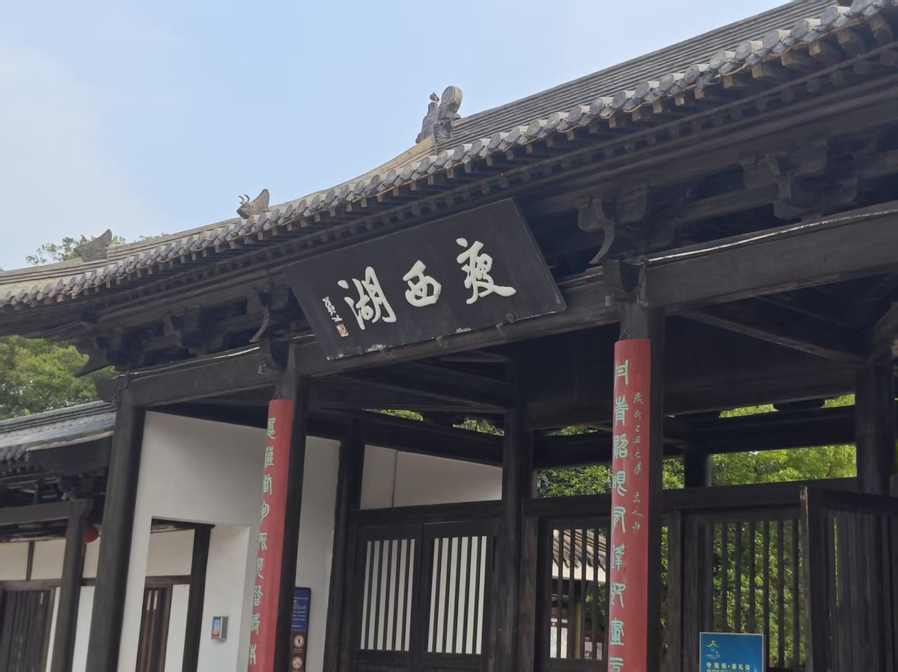

前往瘦西湖。北门大明寺就是鉴真和尚待过的地方，但时间所限就没有进去。

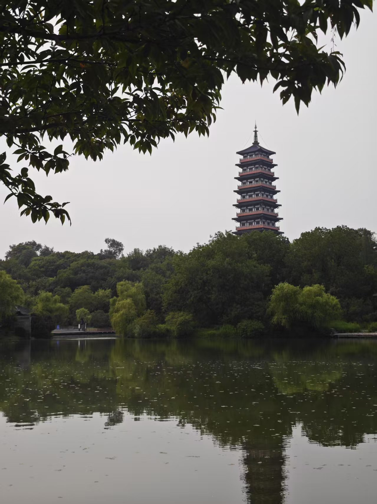

走完瘦西湖，并没有看到非常惊艳的景色，二十四桥也不过如此。也许坐船，或者等明月出来后会更美吧。

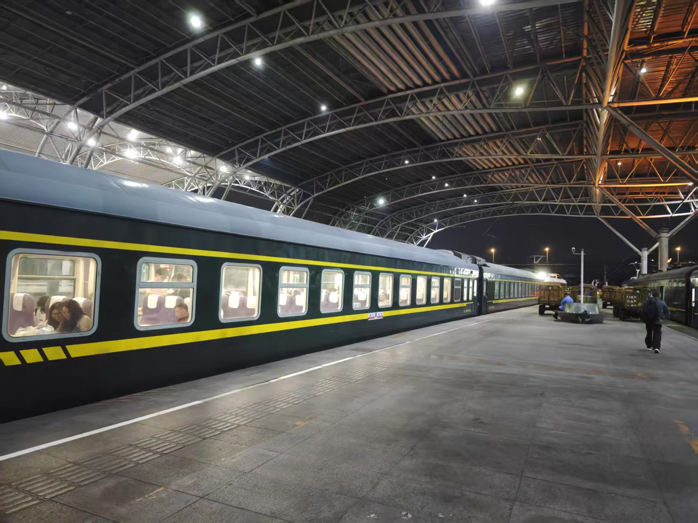

晚上坐火车回南京。
